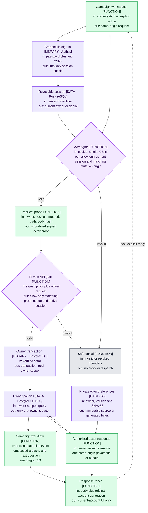
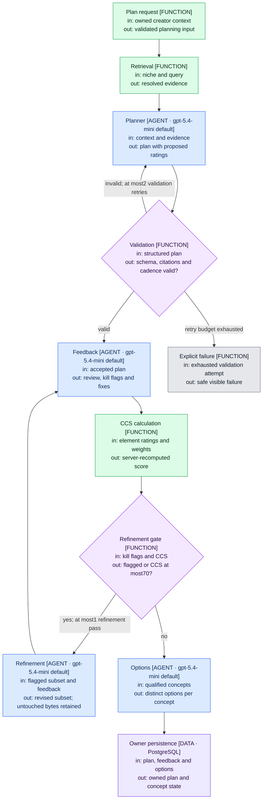
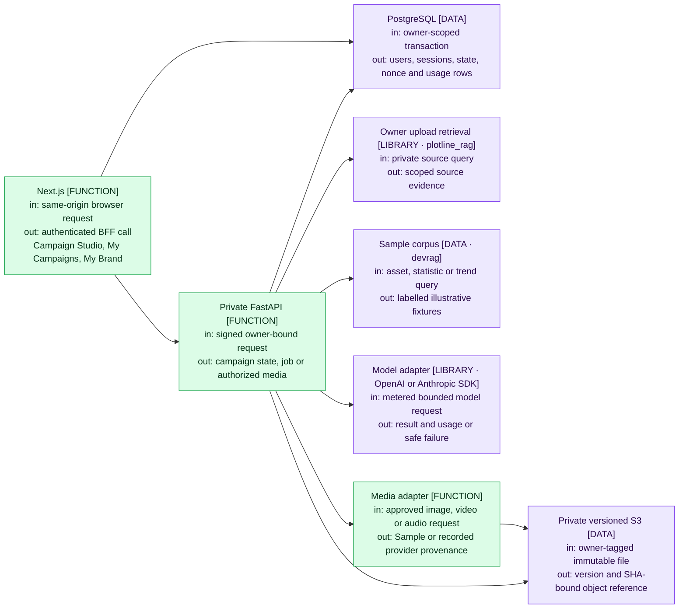

# Plotline architecture and workflow

Updated2026-10-01. This describes the deployed portfolio integration. AWS free gates, one controlled image reroll and ordinary live-mode acceptance are verified; live text/video/full-QC are not proven by that image test. The current front door is conversational Campaign Studio. The older plan API remains represented separately, not as an extra product navigation path.

`FUNCTION` is deterministic code, `AGENT` invokes a configured language model, `LIBRARY` delegates to a named dependency, and `DATA` is persisted state. Blue boxes are agents, green functions, purple decisions, cyan questions, and pale purple data/libraries. Model labels show current code defaults; operator overrides and mock/cached mode remain authoritative.

## Gates at a glance

- Next validates the revocable session; unsafe requests additionally require the exact application Origin and session-bound CSRF. FastAPI verifies the independent short-lived method/path/body proof and current session again.
- Database transactions carry the verified owner. RLS and owner-aware file references protect state, canon, source and generated files. Human canon IDs are reusable across owners, not shared identities.
- A campaign requires complete intake and explicit approvals. Every keyframe must be approved before motion. Rendering actions remain in the conversation; existing detail controls remain available.
- At most1 background job runs per thread,2 per owner and4 per process. Captured actor scope is revalidated. Recovery offers an explicit user Retry with a possible-prior-charge warning; reopening the page does not dispatch work.
- Cached campaign mode is stored by the server and cannot be upgraded by caller fields. Sample media has zero provider cost. Provider-reported credits are distinct from unverified USD estimates.
- Model requests enforce priced-model admission, input/output/tool/deadline caps and usage reservation. Ambiguous dispatched failures retain their reservation; definite pre-dispatch rejection may release it.

## Source index

- Account UI and asynchronous fences: `web/components/account-shell.tsx`, `web/lib/client/session.ts`.
- Session, CSRF and BFF boundary: `web/server/auth.js`, `security.js`, `bridge.js`; `api/app/auth.py`.
- Owner scope and persistence: `api/app/execution.py`, `database.py`, `store.py`, `media_storage.py`, `migrations/001_portfolio.sql`.
- Conversation/state/recovery: `api/app/campaign.py`, `threadkit.py`, `examples.py`.
- Model and media dispatch: `api/app/agents/runner.py`, `providers.py`, `usage.py`, `media.py`, `media_transport.py`.
- UI artifact inspection and spending-action gates: `web/app/studio/thread/[threadId]/page.tsx`, `web/components/campaign-artifacts.tsx`.

The `.mmd` files have source-path headers for staleness review. The generated `architecture-flow.html` is a companion viewer, not a runtime dependency.

## 00-portfolio-boundaries

## 01-plan-pipeline

## 02-system-topology

## 10-agentic-flow

```mermaid
%% granularity: full
%% files: app/campaign.py, app/examples.py, app/threadkit.py, app/agents/runner.py, app/agents/providers.py, app/config.py, app/usage.py, app/media.py, ../web/app/studio/thread/[threadId]/page.tsx
%% Current conversation-only flow. Configurable model defaults are shown, not a claim of paid acceptance.
flowchart TB
  NAME["Start campaign [FUNCTION]<br/>in: name and verified owner<br/>out: owned campaign and thread"]
  SAMPLE["Prepared intake [FUNCTION]<br/>in: canonical ceramic-mug example ID<br/>out: three stored input fragments and permanent cached mode"]
  MODE{"Execution mode [FUNCTION]<br/>in: persisted campaign plus operator mode<br/>out: fixture or metered live agent path"}
  FIX["Prepared agent output [FUNCTION]<br/>in: saved context and stage schema<br/>out: clearly labelled fixture result, no provider"]
  RESERVE["Admission and usage reserve [FUNCTION]<br/>in: actor, priced model, bounded request<br/>out: admitted dispatch or safe rejection"]
  LLM["Campaign agent [AGENT · gpt-5.4-mini default]<br/>in: stage prompt and bounded context<br/>out: structured result or retrieval tool request"]
  TOOLS["Retrieval tool [FUNCTION]<br/>in: allowed corpus query<br/>out: owner upload or labelled sample evidence"]
  VALIDATE["Schema and citation validation [FUNCTION]<br/>in: agent result<br/>out: accepted stage artifact or explicit failure"]
  INTAKE{"Intake readiness [FUNCTION]<br/>in: accumulated product, campaign and brand<br/>out: required blocks and claims confirmation present?"}
  ASK["Conversation question [FUNCTION]<br/>in: missing fields or artifact actions<br/>out: question and explicit options above composer"]
  BRIEF["Brief review [FUNCTION]<br/>in: validated brief<br/>out: user approval"]
  OPTIONS["Options and review [FUNCTION]<br/>in: planner directions and configured council<br/>out: reviewed selectable directions"]
  DETAIL["Detail and board review [FUNCTION]<br/>in: selected direction, optional style, video script<br/>out: approved shot or image board"]
  CANON["Canon review [FUNCTION]<br/>in: approved board references<br/>out: approved owner-library identities"]
  KEYFRAME{"Keyframe gate [FUNCTION]<br/>in: rendered stills and approvals<br/>out: proceed only when every frame is approved"}
  CONFIRM["Generation choice [FUNCTION]<br/>in: proposed single or variants and billing status<br/>out: explicit user render approval"]
  MEDIA["Media adapter [FUNCTION]<br/>in: approved prompt, refs and mode<br/>out: Sample or recorded provider output"]
  CREATIVE["Creative review [FUNCTION]<br/>in: generated artifacts and provenance<br/>out: accept or explicit per-asset reroll"]
  QC["QC gate [FUNCTION]<br/>in: accepted creative and checks<br/>out: cleared or acknowledged defects"]
  DONE["Deliver [FUNCTION]<br/>in: explicit delivery action<br/>out: owned AdCard and private downloadable bundle"]
  JOB["Background job admission [FUNCTION]<br/>in: actor and allowlisted operation<br/>out: at most1 job per thread,2 per owner,4 per process"]
  RECOVER["Interrupted-step recovery [FUNCTION]<br/>in: persisted allowlisted job and current owner<br/>out: explicit Retry warning, never automatic replay"]
  NAME --> MODE
  SAMPLE --> MODE
  MODE -->|"mock or stored cached"| FIX --> VALIDATE
  MODE -->|"live"| RESERVE --> LLM --> VALIDATE
  LLM -->|"allowed tool request"| TOOLS --> LLM
  VALIDATE --> INTAKE
  INTAKE -->|"missing"| ASK
  ASK -.->|"next typed reply retains context"| MODE
  INTAKE -->|"ready; user selects Start"| BRIEF
  BRIEF -->|"approve"| OPTIONS -->|"approve direction"| DETAIL
  DETAIL -->|"approve board"| CANON -->|"approve canon"| KEYFRAME
  KEYFRAME -->|"all approved"| CONFIRM
  KEYFRAME -->|"not all approved"| ASK
  CONFIRM -->|"explicit choice"| JOB --> MEDIA --> CREATIVE
  CREATIVE -->|"accept"| QC -->|"explicit Deliver"| DONE
  CREATIVE -.->|"explicit reroll"| JOB
  JOB -->|"failure or restart"| RECOVER
  RECOVER -.->|"user Retry; session revalidated"| JOB
  classDef agent fill:#dbeafe,stroke:#2563eb,color:#0b2a5b;
  classDef fn fill:#dcfce7,stroke:#16a34a,color:#052e16;
  classDef dec fill:#f3e8ff,stroke:#9333ea,color:#2a0a4a;
  classDef term fill:#e5e7eb,stroke:#6b7280,color:#111827;
  classDef ask fill:#cffafe,stroke:#0891b2,color:#083344;
  classDef data fill:#ede9fe,stroke:#7c3aed,color:#2a0a4a;
  class NAME,SAMPLE,FIX,RESERVE,TOOLS,VALIDATE,BRIEF,OPTIONS,DETAIL,CANON,CONFIRM,MEDIA,CREATIVE,QC,JOB fn;
  class MODE,INTAKE,KEYFRAME dec;
  class ASK,RECOVER ask;
  class LLM agent;
  class DONE term;
```

