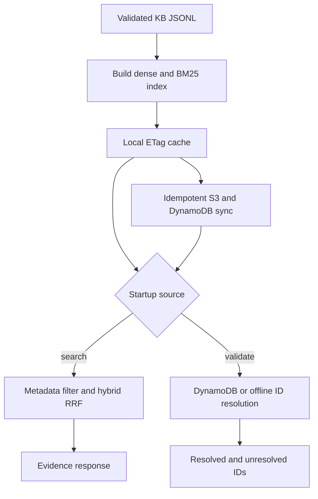

# Architecture flow

The service contains no LLM agent. Every box is deterministic code, a local library, or a data store.

## Legend

- Green: deterministic function
- Purple: data store or library
- Lavender diamond: branch or enforced gate
- Gray: terminal result

## Master flow

## Gates at a glance

| Gate | Enforcer | Threshold or behavior |
|---|---|---|
| Corpus size | `read_chunks` | Reject above 20,000 chunks |
| Artifact integrity | `HybridSearch._verify_artifacts` | SHA-256 must match manifest before pickle load |
| DynamoDB cost | `DynamoChunkStore.sync_chunks` | Sleep for item write units / 1 WCU |
| AWS billing fence | `DynamoChunkStore.validate_free_tier_fence` | Provisioned only; target exactly 1/1; all Plotline tables at most 10/10 |
| S3 idempotency | `S3Store.bundle_is_current` | Skip only when manifest and all objects match |
| Reranking | `HybridSearch.search` | `false` in v1; explicit HTTP 400 if requested |
| Validator input | Pydantic | 1–100 unique nonblank source IDs |

## File index

| Stage | Source |
|---|---|
| Configuration/TLS | `src/plotline_rag/config.py` |
| Contracts | `src/plotline_rag/schema.py` |
| S3 cache | `src/plotline_rag/store/s3.py` |
| DynamoDB validator store | `src/plotline_rag/store/ddb.py` |
| Embeddings | `src/plotline_rag/index/embed.py` |
| Build/sync | `src/plotline_rag/index/build.py` |
| Search | `src/plotline_rag/search/hybrid.py` |
| API | `src/plotline_rag/service.py` |

The canonical detailed diagrams are `docs/mermaid/01-master.mmd`, `02-index-sync.mmd`, and `03-search-resolve.mmd`. A standalone viewer is generated at `docs/architecture-flow.html`.
